# 监督学习：从高维观察预测输出变量

监督学习解决的问题

**监督学习** 在于学习两个数据集的联系：观察数据`X`和我们正在尝试预测的额外变量`y`(通常称“目标”或“标签”)， 而且通常是长度为`n_samples`的一维数组。

scikit-learn 中所有监督的 **估计量** 都有一个用来拟合模型的`fit(X, y)`方法，和根据给定的没有标签观察值`X `回预测的带标签的`y`的`predict(X)`方法。

词汇：分类和回归

如果预测任务是为了将观察值分类到有限的标签集合中，换句话说，就是给观察对象命名，那任务就被称为**分类**任务。另外，如果任务是为了预测一个连续的目标变量，那就被称为 **回归** 任务。

当在 scikit-learn 中进行分类时，y 是一个整数或字符型的向量。

## 最近邻和维度惩罚

鸢尾属植物分类：


eigenvector 是特征向量的意思.

鸢尾属植物数据集是根据花瓣长度、花瓣度度、萼片长度和萼片宽度4个特征对3种不同类型的鸢尾属植物进行分类:

### K近邻分类器

最近邻: 也许是最简单的分类器：给定一个新的观察值`X_test`，用最接近的特征向量在训练集(比如，用于训练估计器的数据)找到观察值。(请看 Scikit-learn 在线学习文档的 最近邻章节 获取更多关于这种分类器的信息)

训练集和测试集

当用任意的学习算法进行实验时，**最重要的就是不要在用于拟合估计器的数据上测试一个估计器的预期值**，因为这不会评估在**新数据**上估计器的执行情况。这也是数据集经常被分为**训练**和**测试**数据的原因。

#### KNN(k 最近邻)分类器例子:

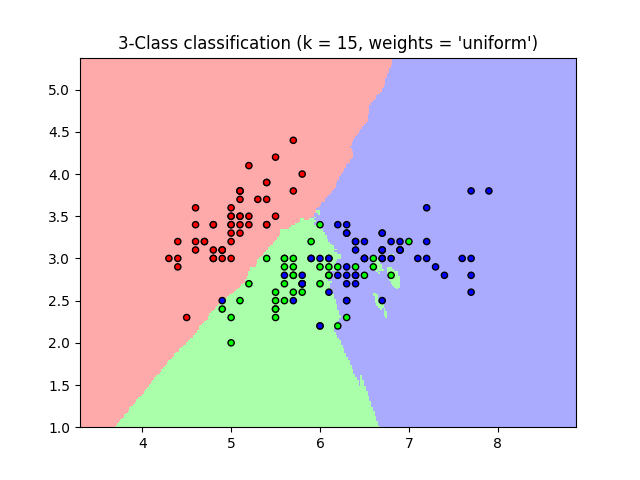

```Python
>>> # 将鸢尾属植物数据集分解为训练集和测试集
>>> # 随机排列，用于使分解的数据随机分布
>>> np.random.seed(0)
>>> indices = np.random.permutation(len(iris_X))
>>> iris_X_train = iris_X[indices[:-10]]
>>> iris_y_train = iris_y[indices[:-10]]
>>> iris_X_test  = iris_X[indices[-10:]]
>>> iris_y_test  = iris_y[indices[-10:]]
>>> # 创建和拟合一个最近邻分类器
>>> from sklearn.neighbors import KNeighborsClassifier
>>> knn = KNeighborsClassifier()
>>> knn.fit(iris_X_train, iris_y_train)
KNeighborsClassifier(algorithm='auto', leaf_size=30, metric='minkowski',
 metric_params=None, n_jobs=1, n_neighbors=5, p=2,
 weights='uniform')
>>> knn.predict(iris_X_test)
array([1, 2, 1, 0, 0, 0, 2, 1, 2, 0])
>>> iris_y_test
array([1, 1, 1, 0, 0, 0, 2, 1, 2, 0])
```

### 维度惩罚(这段官网翻译和编辑的有问题)

为了使一个估计器有效，你需要邻接点间的距离小于一些值：d，这取决于具体问题。

在一维中，这需要平均 n~(1/d) 点。

在上文 K-NN 例子中，如果数据只是由一个0到1的特征值和 n 训练观察值所描述，那么新数据将不会超过 1/n。因此，最近邻决策规则会很有效率，因为与类间特征变量范围相比， 1/n 很小。

如果特征数是 p，你现在就需要 n~(1/d^p) 点。也就是说我们在一维 [0, 1] 空间里需要10个点，在 p 维里就需要 10^p 个点。当 p 增大时，为了得到一个好的估计器，相应的训练点数量就需要成倍增大。

比如，如果每个点只是单个数字(8个字节)，那么一个 K-NN 估计器在一个非常小的 p~20 维度下就需要比现在估计的整个互联网的大小(±1000 艾字节或更多)还要多的训练数据。

这叫 维度惩罚，是机器学习领域的核心问题。

## 线性模型：从回归到稀疏

糖尿病数据集

糖尿病数据集包括442名患者的10个生理特征(年龄，性别，体重，血压)，和一年后的疾病级别指标:

```Python
>>> diabetes = datasets.load_diabetes()
>>> diabetes_X_train = diabetes.data[:-20]
>>> diabetes_X_test  = diabetes.data[-20:]
>>> diabetes_y_train = diabetes.target[:-20]
>>> diabetes_y_test  = diabetes.target[-20:]
```

手头上的任务是为了从生理特征预测疾病级别。

### 线性回归

LinearRegression，最简单的拟合线性模型形式，是通过调整数据集的一系列参数令残差平方和尽可能小。

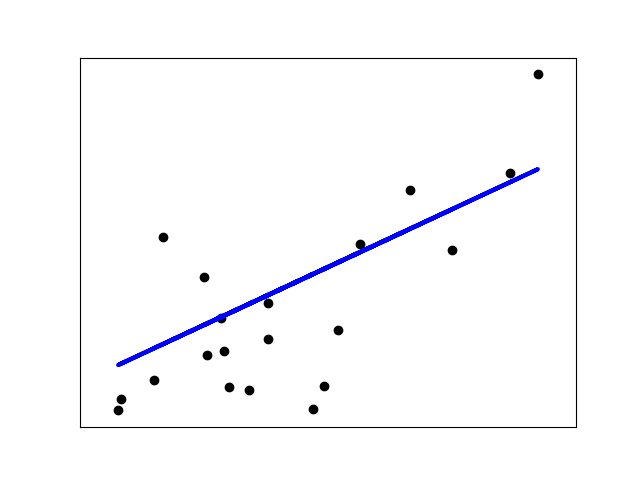

Linear models: y = X$\beta$ + $\epsilon$

>-  X: 数据
- y: 目标变量
- $\beta$: 回归系数
- $\epsilon$: 观察噪声

```Python
>>> from sklearn import linear_model
>>> regr = linear_model.LinearRegression()
>>> regr.fit(diabetes_X_train, diabetes_y_train)
LinearRegression(copy_X=True, fit_intercept=True, n_jobs=1, normalize=False)
>>> print(regr.coef_)
[   0.30349955 -237.63931533  510.53060544  327.73698041 -814.13170937
 492.81458798  102.84845219  184.60648906  743.51961675   76.09517222]

>>> # 均方误差
>>> np.mean((regr.predict(diabetes_X_test)-diabetes_y_test)**2)
2004.56760268...

>>> # 方差分数：1 是完美的预测
>>> # 0 意味着 X 和 y 之间没有线性关系。
>>> regr.score(diabetes_X_test, diabetes_y_test)
0.5850753022690...
```

### 收缩

如果每个维度的数据点很少，观察噪声就会导致很大的方差：

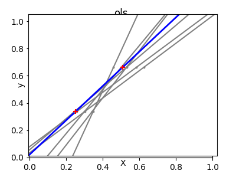

```Python
>>> X = np.c_[ .5, 1].T
>>> y = [.5, 1]
>>> test = np.c_[ 0, 2].T
>>> regr = linear_model.LinearRegression()

>>> import matplotlib.pyplot as plt
>>> plt.figure()

>>> np.random.seed(0)
>>> for _ in range(6):
...    this_X = .1*np.random.normal(size=(2, 1)) + X
...    regr.fit(this_X, y)
...    plt.plot(test, regr.predict(test))
...    plt.scatter(this_X, y, s=3)  
```

高维统计学习的一个解决方案是将回归系数缩小到零：任意两组随机选择的观察结果可能是不相关的。 这称为岭回归：

```Python
regr = linear_model.Ridge(alpha=.1)

plt.figure()

np.random.seed(0)
for _ in range(6):
    this_X = .1*np.random.normal(size=(2, 1)) + X
    regr.fit(this_X, y)
    plt.plot(test, regr.predict(test))
    plt.scatter(this_X, y, s=3)
```
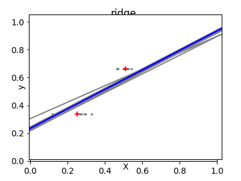

这是 `bias/variance tradeoff` 中的一个例子：岭参数 `alpha` 越大，偏差越大，方差越小。

我们可以选择 alpha 来最小化排除错误，这里使用糖尿病数据集而不是人为数据:

```Python
>>> alphas = np.logspace(-4, -1, 6)
>>> from __future__ import print_function
>>> print([regr.set_params(alpha=alpha
...             ).fit(diabetes_X_train, diabetes_y_train,
...             ).score(diabetes_X_test, diabetes_y_test) for alpha in alphas])
[0.5851110683883..., 0.5852073015444..., 0.5854677540698..., 0.5855512036503..., 0.5830717085554..., 0.57058999437...]
```

捕获拟合参数噪声使得模型不能归纳新的数据称为 **过拟合**。岭回归产生的偏差被称为 **正则化**。

### 稀疏

只拟合特征1和2

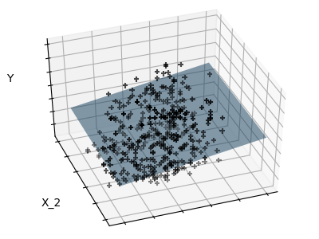

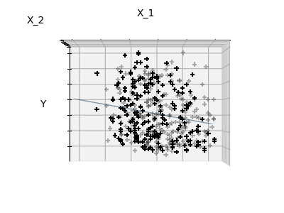

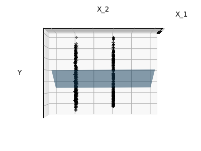

整个糖尿病数据集包括11个维度(10个特征维度和1个目标变量)。很难直观地表示出来，但是记住那是一个比较 空 的空间可能比较有用。

我们可以看到，尽管特征2在整个模型占有一个很大的系数，但是当考虑特征1时，其对`y` 的影响就较小了。

为了提高问题的条件(比如，缓解`维度惩罚`)，只选择信息特征和设置无信息时就会变得有趣，比如特征2到0。岭回归会减小他们的值，但不会减到0.另一种抑制方法，称为 Lasso (最小绝对收缩和选择算子)，可以把一些系数设为0。这些方法称为 **稀疏法**，稀疏可以看作是奥卡姆剃刀的应用：模型越简单越好。

```Python
regr = linear_model.Lasso()
scores = [regr.set_params(alpha=alpha
            ).fit(diabetes_X_train, diabetes_y_train
            ).score(diabetes_X_test, diabetes_y_test)
       for alpha in alphas]
best_alpha = alphas[scores.index(max(scores))]
regr.alpha = best_alpha
regr.fit(diabetes_X_train, diabetes_y_train)
Lasso(alpha=0.025118864315095794, copy_X=True, fit_intercept=True,
 max_iter=1000, normalize=False, positive=False, precompute=False,
 random_state=None, selection='cyclic', tol=0.0001, warm_start=False)
print(regr.coef_)
[   0.         -212.43764548  517.19478111  313.77959962 -160.8303982    -0.
 -187.19554705   69.38229038  508.66011217   71.84239008]
```

同一个问题的不同算法

不同的算法可以用于解决同一个数学问题。比如在 scikit-learn 里`Lasso`对象使用`coordinate descent`方法解决 lasso 回归问题，对于大型数据集很有效。但是，scikit-learn 也提供了使用`LARS`算法 的`LassoLars` 对象，对于处理带权向量非常稀疏的数据非常有效(比如，问题的观察值很少)。

### 分类

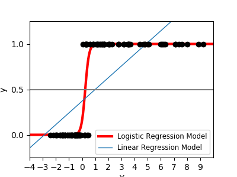

对于分类，比如标定 鸢尾属植物 任务，线性回归就不是好方法了，因为它会给数据很多远离决策边界的权值。一个线性方法是为了拟合 sigmoid 函数 或 logistic 函数：

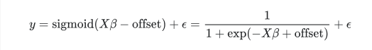

```Python
>>> log = linear_model.LogisticRegression(solver='lbfgs', C=1e5,
...                                       multi_class='multinomial')
>>> log.fit(iris_X_train, iris_y_train)  
LogisticRegression(C=100000.0, class_weight=None, dual=False,
    fit_intercept=True, intercept_scaling=1, max_iter=100,
    multi_class='multinomial', n_jobs=None, penalty='l2', random_state=None,
    solver='lbfgs', tol=0.0001, verbose=0, warm_start=False)
```

这就是有名的： LogisticRegression

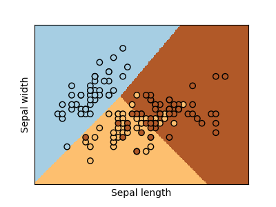

多类分类

如果你有很多类需要预测，一种常用方法就是去拟合一对多分类器，然后使用根据投票为最后做决定。

使用 logistic 回归进行收缩和稀疏

LogisticRegression 对象中的 `C` 参数控制着正则化数量：`C` 值越大，正则化数量越小。`penalty="l2"` 提供 收缩(比如，无稀疏系数)，同时 `penalty=”l1”` 提供稀疏化。

## 支持向量机(SVMs)

### 线性 SVMs

**支持向量机** 属于判别模型家族：它们尝试通过找到样例的一个组合来构建一个两类之间最大化的平面。通过`C`参数进行正则化设置：`C` 的值小意味着边缘是通过分割线周围的所有观测样例进行计算得到的(更正则化)；`C` 的值大意味着边缘是通过邻近分割线的观测样例计算得到的(更少正则化)。

SVMs 可以用于回归(支持向量回归)，或者分类SVC(支持向量分类)。

```Python
>>> from sklearn import svm
>>> svc = svm.SVC(kernel='linear')
>>> svc.fit(iris_X_train, iris_y_train)    
SVC(C=1.0, cache_size=200, class_weight=None, coef0=0.0,
 decision_function_shape='ovr', degree=3, gamma='auto', kernel='linear',
 max_iter=-1, probability=False, random_state=None, shrinking=True,
 tol=0.001, verbose=False)
```

规格化数据

对很多估计器来说，包括 SVMs，为每个特征值使用单位标准偏差的数据集，是获得好的预测重要前提。

### 使用核

在特征空间类并不总是线性可分的。解决办法就是构建一个不是线性的但能是多项式的函数做代替。这要使用 核技巧(kernel trick)，它可以被看作通过设置`kernels`在观察样例上创建决策力量：

线性核函数:

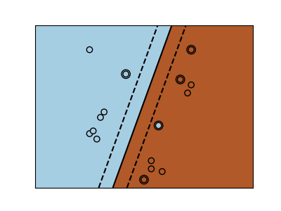

```
>>> svc = svm.SVC(kernel='linear')
```

多项式核函数:

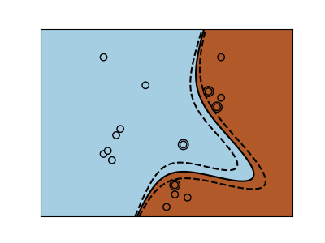

```
>>> svc = svm.SVC(kernel='poly',degree=3)
>>> # degree: polynomial degree
```

RBF 核函数(径向基函数):

```
>>> svc = svm.SVC(kernel='rbf')
>>> # gamma: inverse of size of
>>> # radial kernel
```

#### 交互例子

查看 SVM GUI 通过下载 svm_gui.py；通过左右按键添加两类数据点，拟合模型并改变参数和数据。

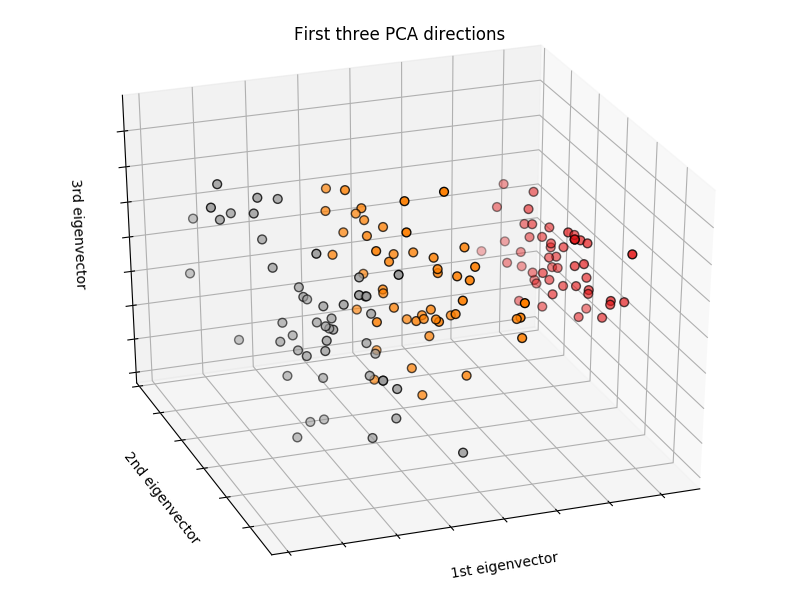

#### 练习

根据特征1和特征2，尝试用 SVMs 把1和2类从鸢尾属植物数据集中分出来。为每一个类留下10%，并测试这些观察值预期效果。

警告: 类是有序的，不要留下最后10%，不然你只能测试一个类了。

提示: 为了直观显示，你可以在网格上使用 decision_function 方法。
```
iris = datasets.load_iris()
X = iris.data
y = iris.target

X = X[y != 0, :2]
y = y[y != 0]
```
