# 无监督学习: 寻求数据表示

## 聚类: 对样本数据进行分组

可以利用聚类解决的问题

对于iris数据集来说，我们知道所有样本有 3 种不同的类型，但是并不知道每一个样本是那种类型：此时我们可以尝试一个**clustering task（聚类任务)**

聚类算法: 将样本进行分组，相似的样本被聚在一起，而不同组别之间的样本是有明显区别的，这样的分组方式就是 clusters（聚类）

### K-means 聚类算法

关于聚类有很多不同的聚类标准和相关算法，其中最简便的算法是`K-means` 。

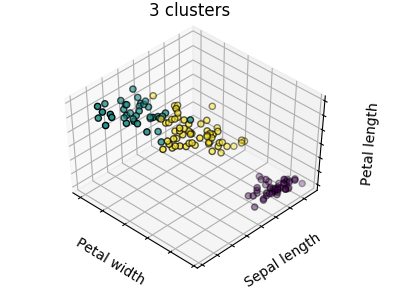

```Python
>>> from sklearn import cluster, datasets
>>> iris = datasets.load_iris()
>>> X_iris = iris.data
>>> y_iris = iris.target

>>> k_means = cluster.KMeans(n_clusters=3)
>>> k_means.fit(X_iris)
KMeans(algorithm='auto', copy_x=True, init='k-means++', ...
>>> print(k_means.labels_[::10])
[1 1 1 1 1 0 0 0 0 0 2 2 2 2 2]
>>> print(y_iris[::10])
[0 0 0 0 0 1 1 1 1 1 2 2 2 2 2]
```

> Warning: k_means 算法无法保证聚类结果完全绝对真实的反应实际情况。
>
> 首先，选择正确合适的聚类数量不是一件容易的事情，
>
> 第二，该算法对初始值的设置敏感，容易陷入局部最优。尽管 scikit-learn 采取了不同的方式来缓解以上问题，目前仍没有完美的解决方案。

### Bad initialization
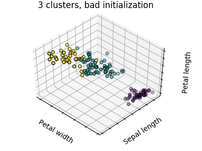

### 8 clusters
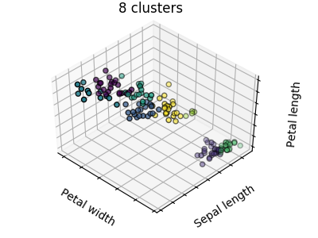

### Ground truth
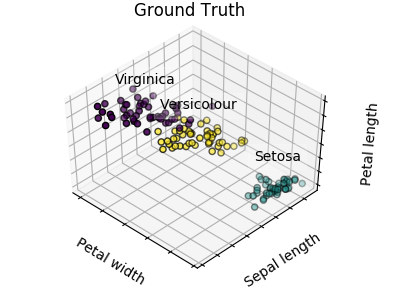

**Don’t over-interpret clustering results（不要过分解读聚类结果）**

**Application example: vector quantization（应用案例:向量量化(vector quantization)）**

一般来说聚类，特别是 K_means 聚类可以作为一种用少量样本来压缩信息的方式。这种方式就是 vector quantization 。例如，K_means 算法可以用于对一张图片进行色调分离:

```Python
>>> import scipy as sp
>>> try:
...    face = sp.face(gray=True)
... except AttributeError:
...    from scipy import misc
...    face = misc.face(gray=True)
>>> X = face.reshape((-1, 1)) # We need an (n_sample, n_feature) array
>>> k_means = cluster.KMeans(n_clusters=5, n_init=1)
>>> k_means.fit(X)
KMeans(algorithm='auto', copy_x=True, init='k-means++', ...
>>> values = k_means.cluster_centers_.squeeze()
>>> labels = k_means.labels_
>>> face_compressed = np.choose(labels, values)
>>> face_compressed.shape = face.shape
```

### Raw image
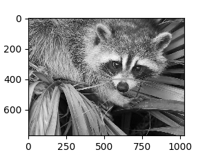

### K-means quantization
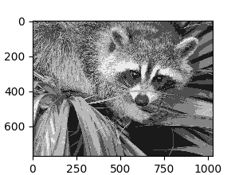

### Equal bins
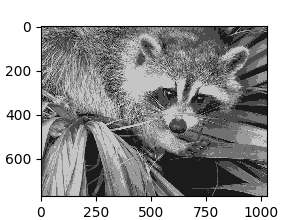

### Image histogram
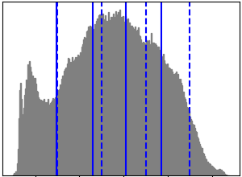

## 分层聚类算法: 谨慎使用

（分层聚类算法）是一种旨在构建聚类层次结构的分析方法，一般来说，实现该算法的大多数方法有以下两种：

- **Agglomerative（聚合）** - 自底向上的方法: 初始阶段，每一个样本将自己作为单独的一个簇，聚类的簇以最小化距离的标准进行迭代聚合。当感兴趣的簇只有少量的样本时，该方法是很合适的。如果需要聚类的 簇数量很大，该方法比K_means算法的计算效率也更高.
- **Divisive（分裂）** - 自顶向下的方法: 初始阶段，所有的样本是一个簇，当一个簇下移时，它被迭代的进行分裂。当估计聚类簇数量较大的数据时，该算法不仅效率低(由于样本始于一个簇，需要被递归的进行 分裂)，而且从统计学的角度来讲也是不合适的。

### 连接约束聚类

对于逐次聚合聚类，通过连接图可以指定哪些样本可以被聚合在一个簇。在 scikit 中，图由邻接矩阵来表示，通常该矩阵是一个稀疏矩阵。这种表示方法是非常有用的，例如在聚类图像时检索连接区域(有时也被称为连接要素):

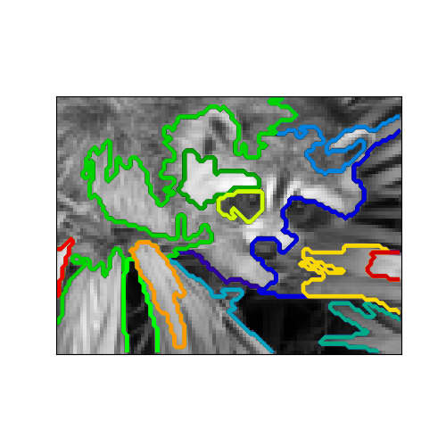

```Python
import matplotlib.pyplot as plt

from sklearn.feature_extraction.image import grid_to_graph
from sklearn.cluster import AgglomerativeClustering
from sklearn.utils.testing import SkipTest
from sklearn.utils.fixes import sp_version

if sp_version < (0, 12):
    raise SkipTest("Skipping because SciPy version earlier than 0.12.0 and "
                   "thus does not include the scipy.misc.face() image.")
###############################################################################
# Generate data
try:
    face = sp.face(gray=True)
except AttributeError:
    # Newer versions of scipy have face in misc
    from scipy import misc
    face = misc.face(gray=True)

# Resize it to 10% of the original size to speed up the processing
face = sp.misc.imresize(face, 0.10) / 255.
```


### 特征聚集

我们已经知道，稀疏性可以缓解特征维度带来的问题，即与特征数量相比，样本数量太少。
另一个解决该问题的方式是合并相似的维度：**feature agglomeration（特征聚集）**。该方法可以通过对特征聚类来实现。换 句话说，就是对样本数据转置后进行聚类。

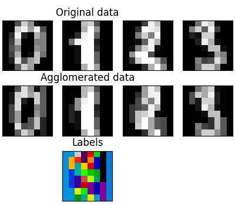

```Python
>>> digits = datasets.load_digits()
>>> images = digits.images
>>> X = np.reshape(images, (len(images), -1))
>>> connectivity = grid_to_graph(*images[0].shape)

>>> agglo = cluster.FeatureAgglomeration(connectivity=connectivity,
...                                      n_clusters=32)
>>> agglo.fit(X)
FeatureAgglomeration(affinity='euclidean', compute_full_tree='auto',...
>>> X_reduced = agglo.transform(X)

>>> X_approx = agglo.inverse_transform(X_reduced)
>>> images_approx = np.reshape(X_approx, images.shape)

```
> transform和inverse_transform方法
> 一些估计器公开的transpose方法，例如减少数据集的维度。

### 分解: 将一个信号转换成多个成份并且加载

> Components and loadings（成分和载荷）
> 如果 X 是多维数据，那么我们试图解决的问题是在不同的观察基础上对数据进行重写。我们希望学习得到载荷 L 和成分 C 使得 X = L C 。提取成分 C 有多种不同的方法。

## 主成份分析: PCA

主成分分析（PCA） 将能够解释数据信息最大方差的的连续成分提取出来

上图中样本点的分布在一个方向上是非常平坦的：即三个单变量特征中的任何一个都可以有另外两个特征来表示。主成分分析法(PCA)可以找到使得数据分布不`flat`的矢量方向(可以反映数据主要信息的特征)。

当用主成分分析(PCA)来`transform（转换）`数据时，可以通过在子空间上投影来降低数据的维数。

```Python
>>> # Create a signal with only 2 useful dimensions
>>> x1 = np.random.normal(size=100)
>>> x2 = np.random.normal(size=100)
>>> x3 = x1 + x2
>>> X = np.c_[x1, x2, x3]

>>> from sklearn import decomposition
>>> pca = decomposition.PCA()
>>> pca.fit(X)
PCA(copy=True, iterated_power='auto', n_components=None, random_state=None,
 svd_solver='auto', tol=0.0, whiten=False)
>>> print(pca.explained_variance_)  
[  2.18565811e+00   1.19346747e+00   8.43026679e-32]

>>> # As we can see, only the 2 first components are useful
>>> pca.n_components = 2
>>> X_reduced = pca.fit_transform(X)
>>> X_reduced.shape
(100, 2)
```

## 独立成分分析: ICA

独立成分分析（ICA） 可以提取数据信息中的独立成分，这些成分载荷的分布包含了最多的 的独立信息。该方法能够恢复 non-Gaussian（非高斯） 独立信号:

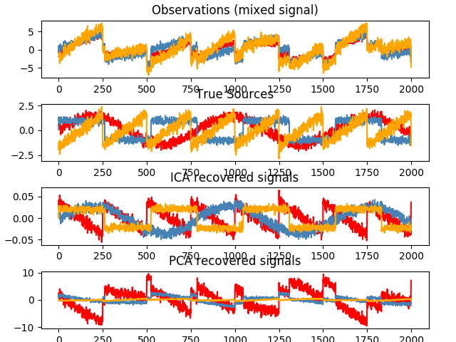
