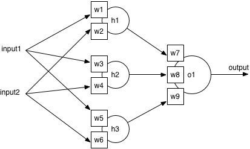

# CNN入门讲解：什么是激活函数（Activation Function）

实际上，从下采样层出来的结果，不是又到卷积层，而是进入了一个激活函数（activation function）

在讨论激活函数之前:

我们先来看一个普通的神经网络有多普通


这应该就是一个小学的线性数学公式吧

没错，其实你小学就已经学了神经网络了

这个神经网络，可以轻松解决普通的线性二分类问题

如下:


So easy


可是现实生活中

更多的是复杂的二分类

你会发现，一个普通的线性神经网络无论怎么移动和反转

都无法将上图分类

因为给出的样本点就不是线性可分的

我记得高数曾教过我们泰勒公式

意思就是一个函数f(x) 可以由N次多项式来表达或者近似

Ok，那我们假设

通过不断叠加简单神经网络得到一个复杂神经网络

最后这个复杂的神经网络可以将上述圆圈和三角形分类

那我们画一个复杂的



```
Output = w7(input1*w1+input2*w2)+w8(input1*w3+input2*w4)+w9(input1*w5+input2*w6)
```

太复杂，看不懂没关系

我们调整一下：

```
Output = input1(w1*w7+w3*w8+w9*w5)+input2*(w2*w7+w4*w8+w6*w9)
```

我们假设Output = 0

```
那么input1 = input2*( w2*w7+w4*w8+w6*w9)/(-w2*w7+w4*w8+w6*w9)
```

最后又回到了y= X*W的线性模式

也就是说，现在的神经网络学习能力非常有限

无法去解决非线性问题

叠加简单神经网络解决不了非线性分类问题

其实大数早已经教过我们

线性函数具有可加性和齐次性

任意线性函数连接都可以等价为一个单一线性函数

好了

第一个问题(ﾟ▽ﾟ*)

线性神经网络没法解决非线性问题

那我们就换种思路

我们能不能把线性神经网络，转成非线性的

也就是把分隔直线转换成曲线

是不是就能解决非线性分类

怎么转

我们从最简单的神经网络 Y = W * X +B入手

然后变成最简单的非线性神经网络Y = W*X*X+B

这是一个普通Y = X*X 的表达式


Y = W*X*X+B 经过一系列运算（理想的）

我们得到了如下：


变成曲线后，好像可以把这两类区分开诶

是不是有点理解了

哦哦

原来如此

第二个问题(ﾟ▽ﾟ*)

我们的神经网络（还是最简单的）

Y =W*X +B

根据input X的值，我们会得到Y值

所以我们需要一个函数可以对得到的Y值进行分类的

比如Y大于0 ，分类为1

小于0 ，分类为0

第三个问题(ﾟ▽ﾟ*)

对于神经网络

Y = W*X +B

我们知道，我们需要算出输出误差error (output Y - target Y) 来更新权值


假设我们的输入X的绝对值特别大，或者无限大，那么Y值就会特别大

直接导致error太大

更新出来的权值没有意义，或者无法更新权值

第四个问题(ﾟ▽ﾟ*)

这个问题涉及到反向传播（back propagation）,可能很多小伙伴会看不懂

你以为我会仔细讲吗？

不

我不会

初学者建议你跳过下面一段

哈哈哈哈哈︿(￣︶￣)︿

如果我们的神经网络函数是线性的

那么它的导数就是个常数

意味着什么

意味着gradient和X 无关了，也就是很输入无关了

我们在做反向传播的时候

Gradient 的改变也变成常数

和输入的改变X(delta(x)) 无关了

综合以上四个问题ヽ(￣▽￣)ﾉ

这个时候，就是我们激活函数（Activation Function）上场了

因为我们最终要解决一个分类问题（classification）

那我们还是从最简单的二分类非线性激活函数开始---阶跃函数（Step Function）


当输入（也就是神经网络Y的输出）大于0就被分类到1（100% 被激活 ），小于0就分到0，（没有被激活）

可是激活值只有100%或者0%未免太不负责了

我们希望它可以是0%---100%任意值

值越大，激活程度越高 对于分类，也就意味着它属于这一类的概率越大

综上所述

各种激活函数层数不穷，各有优缺点

比如大家都经常听到或者用到的

Relu, sigmoid,tanh等等


你看sigmoid 只会输出正数，以及靠近0的输出变化率最大，tanh和sigmoid不同的是，tanh输出可以是负数，ReLu是输入只能大于0,如果你输入含有负数，ReLu就不适合，如果你的输入是图片格式，ReLu就挺常用的。

因为每个激活函数都要考虑输入输出以及数据变化

所以要谨慎选择

激活函数确实是很好宽广的点，它对于提高模型鲁棒性，非线性表达能力，缓解梯度消失问题，将特征图映射到新的特征空间从何更有利于训练，加速模型收敛等问题都有很好的帮助

这个要讲就很广了，这里就不多说了
