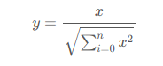
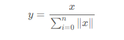

上一篇文章讲解了数据预处理区间缩放法，这篇文章主要讲解数据归一化处理

既然讲到归一化和前面的标准化需要对比一下，首先二者处理的维度是不一样的，假设我们要处理的矩阵是 `m*n` 大小，`m` 个样本，`n` 维特征

标准化处理的方式是以列为单位，也就是处理的对象是:

```
m ∗ kk = 1...n
```

归一化处理的方式却是以行为单位，处理的对象如下：

```
k ∗ nk = 1...m
```

**归一化处理对样本的特征向量处理之后使其变为单位向量，单位向量可以用于点积运算或者计算样本之间相似度**

L2 归一化的计算公式如下所示：



L1 归一化的计算公式如下所示



sklearn 代码

```Python
from sklearn.preprocessing import Normalizer
tmp=Normalizer().fit_transform(irisdata.data)
print tmp[0:5]
```

实验结果如下

```
[[ 0.80377277  0.55160877  0.22064351  0.0315205 ]
 [ 0.82813287  0.50702013  0.23660939  0.03380134]
 [ 0.80533308  0.54831188  0.2227517   0.03426949]
 [ 0.80003025  0.53915082  0.26087943  0.03478392]
 [ 0.790965    0.5694948   0.2214702   0.0316386 ]]
```

spark代码如下

```Python
from pyspark.ml.feature import Normalizer

dataFrame = sqlContext.read.format("libsvm").load("data/mllib/sample_libsvm_data.txt")

# p=2 则表示是 l2 归一化
normalizer = Normalizer(inputCol="features", outputCol="normFeatures", p=1.0)
l1NormData = normalizer.transform(dataFrame)
l1NormData.show()
```
