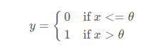

上一篇文章讲解了区间缩放法处理数据，接下来就讲解二值化处理

这个应该很简单了，从字面意思就是将数据分为`0`或者`1`，联想到之前图像处理里面二值化处理变为黑白图片

下面还是进入主题吧

首先给出当前的二值化处理公式：



上图中
`θ` 是设定的阈值，特征值与阈值相比较，大于阈值则为 1 小于等于阈值为 0

sklearn 函数

```python
from sklearn.preprocessing import  Binarizer
tmp=Binarizer().fit_transform(irisdata.data)
print tmp[0:5]
```

```
输出结果

[[ 1.  1.  1.  1.]
 [ 1.  1.  1.  1.]
 [ 1.  1.  1.  1.]
 [ 1.  1.  1.  1.]
 [ 1.  1.  1.  1.]]
```

spark 函数

```Python
>>> df = sqlContext.createDataFrame([(0.5,)], ["values"])
>>> binarizer = Binarizer(threshold=1.0, inputCol="values", outputCol="features")
>>> binarizer.transform(df).head().features
0.0
#setParams 是用来设置二值化参数
>>> binarizer.setParams(outputCol="freqs").transform(df).head().freqs
0.0
>>> params = {binarizer.threshold: -0.5, binarizer.outputCol: "vector"}
>>> binarizer.transform(df, params).head().vector
1.0
 transform(dataset, params=None)，其中 param 可以是字典参数，字典的键是类对象成员
 ```
