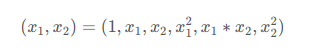

上一篇讲解了使用哑编码的方式来进行数据预处理，这篇文章看起来只是用来作为数据类型的转换，比如多项式操作或者自定义函数

常见的数据变换有基于多项式的、基于指数函数的、基于对数函数的。`2` 个特征，度为`2`的多项式转换公式如下：



```python
from sklearn.preprocessing import PolynomialFeatures
data=PolynomialFeatures().fit_transform(irisdata.data)
print data[0:5]
[[  1.     5.1    3.5    1.4    0.2   26.01  17.85   7.14   1.02  12.25
    4.9    0.7    1.96   0.28   0.04]
 [  1.     4.9    3.     1.4    0.2   24.01  14.7    6.86   0.98   9.     4.2
    0.6    1.96   0.28   0.04]
 [  1.     4.7    3.2    1.3    0.2   22.09  15.04   6.11   0.94  10.24
    4.16   0.64   1.69   0.26   0.04]
 [  1.     4.6    3.1    1.5    0.2   21.16  14.26   6.9    0.92   9.61
    4.65   0.62   2.25   0.3    0.04]
 [  1.     5.     3.6    1.4    0.2   25.    18.     7.     1.    12.96
    5.04   0.72   1.96   0.28   0.04]]
```

spark 函数剖析

```python
>>>from pyspark.mllib.linalg import Vectors
>>>from pyspark.ml.feature import PolynomialExpansion
>>> df = sqlContext.createDataFrame([(Vectors.dense([0.5, 2.0]),)], ["dense"])
>>> px = PolynomialExpansion(degree=2, inputCol="dense", outputCol="expanded")
>>> px.transform(df).head().expanded
DenseVector([0.5, 0.25, 2.0, 1.0, 4.0])
>>> px.setParams(outputCol="test").transform(df).head().test
DenseVector([0.5, 0.25, 2.0, 1.0, 4.0])
```
备注：spark 和 sklearn 有点不一样，sklearn 总会包含数字 1
