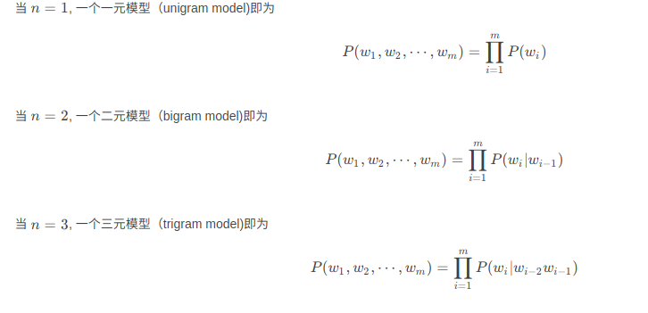
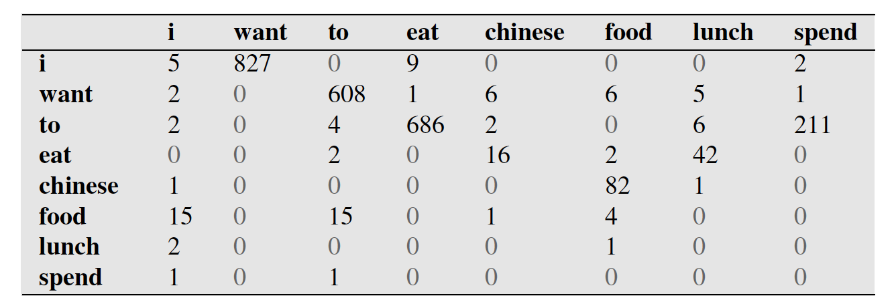
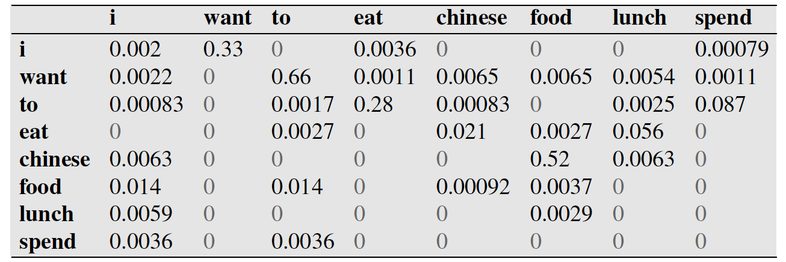

> 原文：https://blog.csdn.net/baimafujinji/article/details/51281816

# 自然语言处理中的N-Gram模型详解

N-Gram（有时也称为N元模型）是自然语言处理中一个非常重要的概念，通常在NLP中，人们基于一定的语料库，可以利用N-Gram来预计或者评估一个句子是否合理。**另外一方面，N-Gram的另外一个作用是用来评估两个字符串之间的差异程度。这是模糊匹配中常用的一种手段。** 本文将从此开始，进而向读者展示N-Gram在自然语言处理中的各种powerful的应用。

- 基于N-Gram模型定义的字符串距离
- 利用N-Gram模型评估语句是否合理
- 使用N-Gram模型时的数据平滑算法

## 基于N-Gram模型定义的字符串距离

> 在自然语言处理时，最常用也最基础的一个操作是就是“模式匹配”，或者称为“字符串查找”。而模式匹配（字符串查找）又分为精确匹配和模糊匹配两种。

所谓精确匹配，大家应该并不陌生，比如我们要统计一篇文章中关键词 “information” 出现的次数，这时所使用的方法就是精确的模式匹配。这方面的算法也比较多，而且应该是计算机相关专业必修的基础课中都会涉及到的内容，例如KMP算法、BM算法和BMH算法等等。

另外一种匹配就是所谓的模糊匹配，它的应用也随处可见。例如，一般的文字处理软件（例如，Microsoft Word等）都会提供 **拼写检查** 功能。当你输入一个错误的单词，例如 “ informtaion” 时，系统会提示你是否要输入的词其实是 “information” 。将一个可能错拼单词映射到一个推荐的正确拼写上所采用的技术就是模糊匹配。

**模糊匹配的关键在于如何衡量两个长得很像的单词（或字符串）之间的“差异”。这种差异通常又称为“距离”。**

这方面的具体算法有很多，例如基于编辑距离的概念，人们设计出了 Smith-Waterman 算法和Needleman-Wunsch 算法，其中后者还是历史上最早的应用动态规划思想设计的算法之一。现在Smith-Waterman 算法和Needleman-Wunsch 算法在生物信息学领域也有重要应用，研究人员常常用它们来计算两个DNA序列片段之间的“差异”（或称“距离”）。
甚至于在LeetCode上也有一道“No.72 Edit Distance”，其本质就是在考察上述两种算法的实现。可见相关问题离我们并不遥远。

## N-Gram在模糊匹配中的应用

事实上，笔者在新出版的《算法之美——隐匿在数据结构背后的原理》一书中已经详细介绍了包括Needleman-Wunsch算法、Smith-Waterman算法、N-Gram算法、Soundex算法、Phonix算法等在内的多种距离定义算法（或模糊匹配算法）。而今天为了引出N-Gram模型在NLP中的其他应用，我们首先来介绍一下如何利用N-Gram来定义字符串之间的距离。

**我们除了可以定义两个字符串之间的编辑距离（通常利用Needleman-Wunsch算法或Smith-Waterman算法）之外，还可以定义它们之间的N-Gram距离。N-Gram（有时也称为N元模型）是自然语言处理中一个非常重要的概念。**

假设有一个字符串`s`，那么该字符串的N-Gram就表示按长度`N`切分原词得到的词段，也就是 `s` 中所有长度为`N`的子字符串。设想如果有两个字符串，然后分别求它们的N-Gram，那么就可以从它们的共有子串的数量这个角度去定义两个字符串间的N-Gram距离。但是仅仅是简单地对共有子串进行计数显然也存在不足，这种方案显然忽略了两个字符串长度差异可能导致的问题。比如字符串`girl`和`girlfriend`，二者所拥有的公共子串数量显然与`girl`和其自身所拥有的公共子串数量相等，但是我们并不能据此认为 `girl` 和`girlfriend` 是两个等同的匹配。

为了解决该问题，有学者便提出以非重复的N-Gram分词为基础来定义 N-Gram距离这一概念，可以用下面的公式来表述：


此处，|GN(s)| 是字符串`s`的 N-Gram集合，`N` 值一般取2或者3。以 `N = 2` 为例对字符串Gorbachev和Gorbechyov进行分段，可得如下结果（我们用下画线标出了其中的公共子串）。


**结合上面的公式，即可算得两个字符串之间的距离是`8 + 9 − 2 × 4 = 9`。显然，字符串之间的距离越小，它们就越接近。当两个字符串完全相等的时候，它们之间的距离就是0。**

## 利用N-Gram计算字符串间距离的Java实例

在《算法之美——隐匿在数据结构背后的原理》一书中，我们给出了在C++下实现的计算两个字符串间N-Gram距离的函数，鉴于全书代码已经在本博客中发布，这里不再重复列出。事实上，很多语言的函数库或者工具箱中都已经提供了封装好的计算 N-Gram 距离的函数，下面这个例子演示了在Java中使用N-Gram 距离的方法。

针对这个例子，这里需要说明的是：

调用函数需要引用lucene的JAR包，我所使用的是lucene-suggest-5.0.0.jar

前面我们所给出的算法计算所得为一个绝对性的距离分值。而Java中所给出的函数在此基础上进行了归一化，也就是说所得之结果是一个介于0~1之间的浮点数，即0的时候表示两个字符串完全不同，而1则表示两个字符串完全相同。

```java
import org.apache.lucene.search.spell.*;

public class NGram_distance {

    public static void main(String[] args) {

        NGramDistance ng = new NGramDistance();
        float score1 = ng.getDistance("Gorbachev", "Gorbechyov");
        System.out.println(score1);
        float score2 = ng.getDistance("girl", "girlfriend");
        System.out.println(score2);
    }
}
```

有兴趣的读者可以在引用相关JAR包之后在Eclipse中执行上述Java程序，你会发现，和我们预期的一样，字符串Gorbachev和Gorbechyov所得之距离评分较高（=0.7），说明二者很接近；而girl和girlfriend所得之距离评分并不高（=0.3999），说明二者并不很接近。

---------------

## 利用N-Gram模型评估语句是否合理

从现在开始，我们所讨论的N-Gram模型跟前面讲过N-Gram模型从外在来看已经大不相同，但是请注意它们内在的联系（或者说本质上它们仍然是统一的概念）。

为了引入N-Gram的这个应用，我们从几个例子开始。
首先，从统计的角度来看，自然语言中的一个句子`s`可以由任何词串构成，不过概率`P(s)`有大有小。例如：

s1 = 我刚吃过晚饭

s2 = 刚我过晚饭吃

显然，对于中文而言`s1`是一个通顺而有意义的句子，而`s2`则不是，所以对于中文来说，`P(s1)>P(s2)` 。但不同语言来说，这两个概率值的大小可能会反转。

其次，另外一个例子是，如果我们给出了某个句子的一个节选，我们其实可以能够猜测后续的词应该是什么，例如

- the large green __ . Possible answer may be “mountain” or “tree” ?
- Kate swallowed the large green __ . Possible answer may be “pill” or “broccoli” ?

显然，如果我们知道这个句子片段更多前面的内容的情况下，我们会得到一个更加准确的答案。这就告诉我们，前面的（历史）信息越多，对后面未知信息的约束就越强。


这个概率显然并不好算，不妨利用马尔科夫链的假设，即当前这个词仅仅跟前面几个有限的词相关，因此也就不必追溯到最开始的那个词，这样便可以大幅缩减上诉算式的长度。即


特别地，对于`n`取得较小值的情况



接下来的思路就比较明确了，可以利用最大似然法来求出一组参数，使得训练样本的概率取得最大值。


来看一个具体的例子，假设我们现在有一个语料库如下，其中`<s1><s2>`是句首标记，`</s2></s1>`是句尾标记


下面我们的任务是来评估如下这个句子的概率：


我们来演示利用**trigram**模型来计算概率的结果


所以我们要求的概率就等于：


再举一个来自文献[1]的例子，假设现在有一个语料库，我们统计了下面一些词出现的数量


下面这个概率作为其他一些已知条件给出：


下面这个表给出的是基于Bigram模型进行计数之结果



例如，其中第一行，第二列 表示给定前一个词是 “i” 时，当前词为“want”的情况一共出现了827次。据此，我们便可以算得相应的频率分布表如下。




## 使用N-Gram模型时的数据平滑算法

有研究人员用150万词的训练语料来训练 trigram 模型，然后用同样来源的测试语料来做验证，结果发现23%的 trigram 没有在训练语料中出现过。这其实就意味着上一节我们所计算的那些概率有空为 0，这就导致了数据稀疏的可能性，我们的表3中也确实有些为0的情况。对语言而言，由于数据稀疏的存在，极大似然法不是一种很好的参数估计办法。

这时的解决办法，我们称之为“平滑技术”（Smoothing）或者 “减值” （Discounting）。

其主要策略是把在训练样本中出现过的事件的概率适当减小，然后把减小得到的概率密度分配给训练语料中没有出现过的事件。实际中平滑算法有很多种，例如：

- Laplacian (add-one) smoothing
- Add-k smoothing
- Jelinek-Mercer interpolation
- Katz backoff
- Absolute discounting
- Kneser-Ney

对于这些算法的详细介绍，我们将在后续的文章中结合一些实例再来进行讨论。

------

## A Final Word

如果你能从前面那些繁冗、复杂的概念和公式中挺过来，恭喜你，你对N-Gram模型已经有所认识了。尽管，我们还没来得及探讨平滑算法（但它即将出现在我的下一篇博文里，如果你觉得还未过瘾的话），但是其实你已经掌握了一个相对powerful的工具。你可以能会问，在实践中N-Gram模型有哪些具体应用，作为本文的结束，主页君便在此补充几个你曾见过的或者曾经好奇它是如何实现的例子。

Eg.1
搜索引擎（Google或者Baidu）、或者输入法的猜想或者提示。你在用百度时，输入一个或几个词，搜索框通常会以下拉菜单的形式给出几个像下图一样的备选，这些备选其实是在猜想你想要搜索的那个词串。再者，当你用输入法输入一个汉字的时候，输入法通常可以联系出一个完整的词，例如我输入一个“刘”字，通常输入法会提示我是否要输入的是“刘备”。通过上面的介绍，你应该能够很敏锐的发觉，这其实是以N-Gram模型为基础来实现的，如果你能有这种觉悟或者想法，那我不得不恭喜你，都学会抢答了！


Eg.2

某某作家或者语料库风格的文本自动生成。这是一个相当有趣的话题。来看下面这段话（该例子取材自文献【1】）：

“You are uniformly charming!” cried he, with a smile of associating and now and then I bowed and they perceived a chaise and four to wish for.

你应该还没有感觉到它有什么异样吧。但事实上这并不是由人类写出的句子，而是计算机根据Jane Austen的语料库利用trigram模型自动生成的文段。（Jane Austen是英国著名女作家，代表作有《傲慢与偏见》等）

再来看两个例子，你是否能看出它们是按照哪位文豪（或者语料库）的风格生成的吗？

This shall forbid it should be branded, if renown made it empty.

They also point to ninety nine point six billion dollars from two hundred four oh three percent of the rates of interest stores as Mexico and Brazil on market conditions.

答案是第一个是莎士比亚，第二个是华尔街日报。最后一个问题留给读者思考，你觉得上面两个文段所运用的n-gram模型中，n应该等于多少？

-----

推荐阅读和参考文献：
[1] Speech and Language Processing. Daniel Jurafsky & James H. Martin, 3rd. Chapter 4
[2] 本文中的一些例子和描述来自 北京大学 常宝宝 以及 The University of Melbourne “Web Search and Text Analysis” 课程的幻灯片素材
